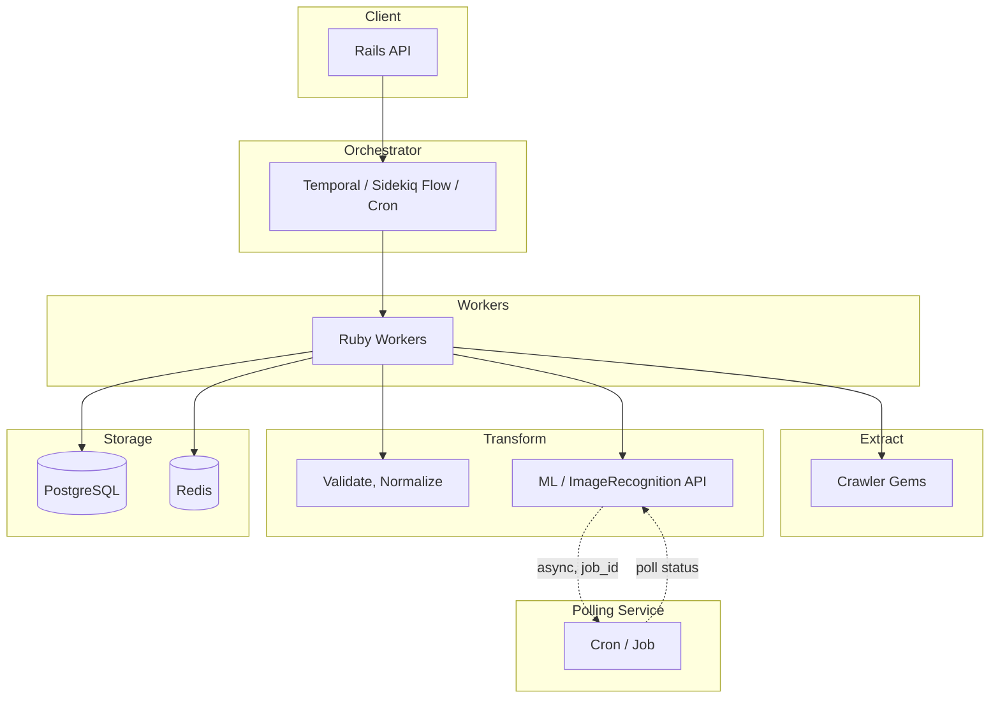
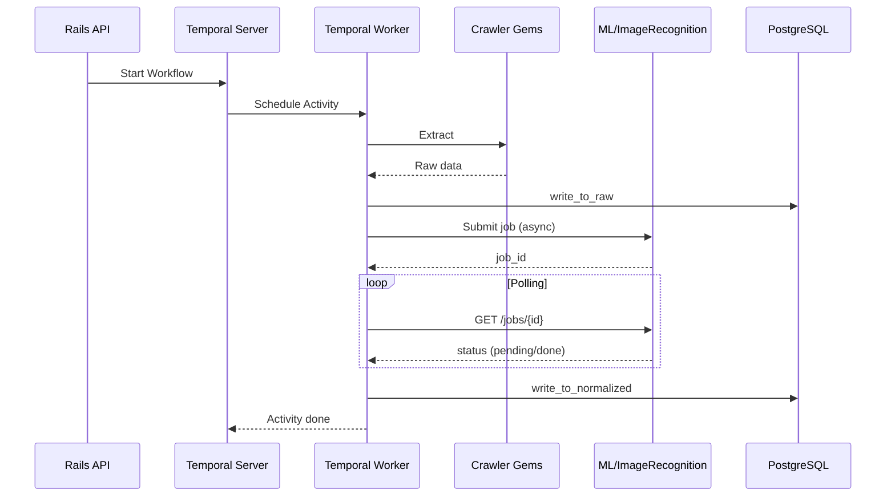
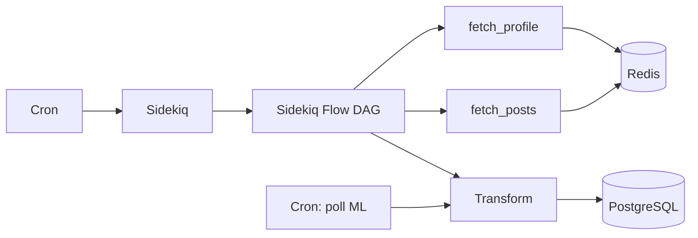

# Технологический стек

**Навигация:** [00](00-INDEX.md) | [01](01-ORCHESTRATOR-CHOICE.md) | [02](02-TECH-STACK.md) | [03](03-DEPLOYMENT-ARCHITECTURE.md) | [04](04-SYNC-FLOW.md) | [05](05-DATA-CONTRACTS.md) | [06](06-OBSERVABILITY.md) | [07](07-RESILIENCE-RESTART.md) | [← Назад](01-ORCHESTRATOR-CHOICE.md) | [Далее →](03-DEPLOYMENT-ARCHITECTURE.md)

---

Варианты сервисных решений под разные оркестраторы и графы взаимодействия систем.

---

## Граф взаимодействия (общий)

---

## Граф взаимодействия (вариант A: Temporal)

---

## Граф взаимодействия (вариант B: Sidekiq Flow)

---

## Вариант A: Temporal + Rails

| Компонент | Технология |
|-----------|------------|
| **Оркестратор** | Temporal (self-hosted) |
| **ЯП / фреймворк** | Ruby 4, Rails 8 |
| **Workers** | Temporal Workers (Ruby SDK) |
| **Краулеры** | Локальные гемы (Instagram, YouTube, TikTok) |
| **Transform (локально)** | Rails, валидация, нормализация |
| **Transform (внешне)** | ML/ImageRecognition — HTTP API, polling |
| **Очереди / хранилище** | PostgreSQL (Temporal + данные), Redis (опционально) |
| **Observability** | OpenTelemetry, Grafana, NewRelic |

**Оркестратор во главе:** да. Temporal управляет workflow, Activity вызывают краулеры и Transform.

---

## Вариант B: Sidekiq Flow + polling-service

| Компонент | Технология |
|-----------|------------|
| **Оркестратор** | Sidekiq Flow (DAG) |
| **ЯП / фреймворк** | Ruby 4, Rails 8 |
| **Workers** | Sidekiq workers |
| **Краулеры** | Локальные гемы (Instagram, YouTube, TikTok) |
| **Transform** | Rails + внешние ML/ImageRecognition (API, polling) |
| **Polling** | Cron или Sidekiq scheduled job — опрос результатов (1 мин — несколько дней) |
| **Очереди / хранилище** | Redis (Sidekiq), PostgreSQL (данные, sync_jobs) |
| **Observability** | OpenTelemetry, Grafana, NewRelic |

**Оркестратор во главе:** Sidekiq Flow — DAG. Checkpoints и resume — вручную (sync_jobs, cursor).

---

## Вариант C: Общий (оркестратор-агностик)

| Компонент | Технология |
|-----------|------------|
| **Оркестратор** | Не выбран (Cron + Sidekiq как минимум) |
| **ЯП / фреймворк** | Ruby 4, Rails 8 |
| **Workers** | Sidekiq workers |
| **Краулеры** | Локальные гемы |
| **Transform** | Локальные шаги + внешние ML (API) |
| **Очереди / хранилище** | Redis, PostgreSQL |
| **Observability** | OpenTelemetry, Grafana, NewRelic |

**Оркестратор во главе:** нет. Cron создаёт job'ы; Sidekiq выполняет; sync_jobs/sync_tasks хранят состояние. Подходит для MVP до выбора оркестратора.

---

## Общие компоненты

### Языки и фреймворки

- **Ruby 4 / Rails 8** — основной ETL, API, краулеры
- **Python** — ML, ImageRecognition (отдельные сервисы), общение через HTTP API

### Краулеры

- **Instagram, YouTube, TikTok** — локальная разработка гемов
- Интеграция — через API, постраничная загрузка, батчи

### Transform

- **Локальные:** валидация, приведение типов, нормализация, маппинг классов
- **Внешние (опционально):** ML, ImageRecognition — распознавание картинок, текста, упоминаний (async API, polling)

### Инфраструктура

- **Kubernetes** — оркестрация контейнеров
- **Docker** — образы
- **Yandex Cloud** — хостинг (переход с AWS)

### Observability

- **Grafana** — дашборды, метрики (дашборды — отдельная задача)
- **NewRelic** — APM, трейсинг
- **OpenTelemetry** — единый источник телеметрии
