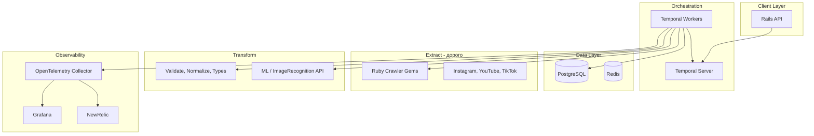

# Архитектура развёртывания

**Навигация:** [00](00-INDEX.md) | [01](01-ORCHESTRATOR-CHOICE.md) | [02](02-TECH-STACK.md) | [03](03-DEPLOYMENT-ARCHITECTURE.md) | [04](04-SYNC-FLOW.md) | [05](05-DATA-CONTRACTS.md) | [06](06-OBSERVABILITY.md) | [07](07-RESILIENCE-RESTART.md) | [← Назад](02-TECH-STACK.md) | [Далее →](04-SYNC-FLOW.md)

---

Диаграмма и описание компонентов.

---

## Диаграмма развёртывания

---

## Extract — самый дорогой этап

Данные из соцсетей получать **дороже всего**:

- **Постраничная загрузка** — всё кроме профилей (посты, подписчики, лайки, комменты)
- **Долго** — в среднем ~1000 запросов на профиль; бывает на 2 порядка больше или меньше (крайне редко, чаще близко к середине)
- **Платно** — API limits, rate limits

Поэтому Extract выделен отдельно и требует:

- Батчинг
- Rate limiting по сети
- Курсоры (since_id, updated_since) для докачки
- Checkpoints для рестарта

---

## Компоненты

| Компонент | Назначение |
|-----------|------------|
| **Rails API** | Точка входа, приём запросов на синк |
| **Temporal Server** | Оркестрация workflow (при варианте A) |
| **Temporal Workers** | Выполнение Activity (Extract, Transform, Load) |
| **PostgreSQL** | Данные, sync_jobs, sync_tasks | 
| **Redis** | Sidekiq / Temporal (опционально) |
| **Crawler Gems** | Extract из Instagram, YouTube, TikTok |
| **Transform (локально)** | Валидация, нормализация, приведение типов |
| **Transform (внешне)** | ML, ImageRecognition — HTTP API, polling |
| **OpenTelemetry** | Трейсинг, метрики |
| **Grafana / NewRelic** | Дашборды, алерты |

---

## Вариант без Temporal (Sidekiq Flow)

При выборе варианта B:

- Temporal Server и Workers заменяются на **Sidekiq** + **Sidekiq Flow**
- Redis — обязателен для Sidekiq
- Polling-service — cron или Sidekiq scheduled job для опроса ML/ImageRecognition
- Остальная схема сохраняется

---

## Инфраструктура

- **Kubernetes** — деплой
- **Docker** — образы приложений
- **Yandex Cloud** — хостинг
