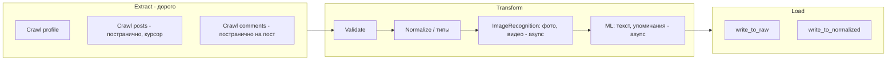

# Флоу синхронизации

**Навигация:** [README](../README.md) | [Меню](00-INDEX.md) | [← Назад](03-DEPLOYMENT-ARCHITECTURE.md) | [Далее →](05-DATA-CONTRACTS.md)

---

Extract (дорого) → Transform (полный) → Load.

---

## Модель по entity

**Entity** = профиль пользователя или бренд-аккаунт в соцсети.

Под-ETL на entity (пример Instagram, список будет расти):

- `sync_profile`
- `sync_subscriptions` (followers/following)
- `sync_posts` — постранично (напр. 12 постов на страницу, курсорная пагинация)
- `sync_comments` — постранично **для каждого поста**
- `sync_highlights` / `sync_stories`
- отдельная лента `sync_reels`
- прочие метрики

---

## DAG на пользователя и сеть

```
fetch_profile
    → fetch_posts_since(last_synced_at)     [постранично, курсорная пагинация]
    → fetch_comments_for_post(post_id)      [постранично, для КАЖДОГО поста]
    → write_to_raw
    → Transform
    → write_to_normalized
```

---

## Последовательность Extract (критично)

Данные из соцсетей выкачиваются **последовательно** — иначе процесс может быть очень долгим и неконтролируемым:

1. **Сначала** — выкачать все посты профиля (постранично, курсорная пагинация)
2. **Затем** — отдельными процессами по каждому посту: комменты, лайки и т.д.

**Пример (Instagram):** посты — по 12 на страницу (число варьируется); для каждого поста — комменты постранично. Плюс followings, highlights, stories, отдельная лента Reels. И это только для одной сети сейчас.

---

## Диаграмма флоу (на элемент, например пост)



---

## Transform — полный состав

### Локальные шаги

- **Validate** — проверка структуры, обязательных полей
- **Normalize** — приведение типов, маппинг классов, единый формат
- Число шагов будет расти

### Внешние шаги (опционально)

- **ImageRecognition** — распознавание медиа (фото, видео). В одном посте может быть много медиа-элементов; на пост — одна подпись (caption)
- **ML** — анализ текста, упоминаний (async API, polling)
- **Профиль:** из пользовательских данных интерес представляет в основном bio

Внешние сервисы уже существуют; общение через API, polling за результатами.

---

## Флоу на элемент (пост)

1. Extract (краулер)
2. Validate
3. Normalize
4. [Опционально] ImageRecognition, ML-анализ текста/упоминаний
5. Load

**Polling** за результатами внешних сервисов: cron или sleep в workflow.

---

## Масштаб

- **Посты на профиль:** тысячи – сотни тысяч
- **Профили:** сотни тысяч
- **В перспективе:** миллионы

---

## Примечания под оркестратор

### Temporal

- Parent Workflow разбивает на батчи (например, 100 профилей)
- Child Workflows по батчу
- Activity: Extract → Transform (с polling) → Load
- Sleep/backoff внутри workflow для polling (Temporal не блокирует thread)

### Sidekiq Flow + polling-service

- Sidekiq Flow — DAG задач
- Polling — cron job или Sidekiq scheduled job для опроса результатов ML/ImageRecognition

### Общий

- Cron ставит джобу; джоба создаёт JobCall
- Sidekiq выполняет шаги
- ServiceCall.cursor, JobCall/ServiceCall — для докачки и рестарта
