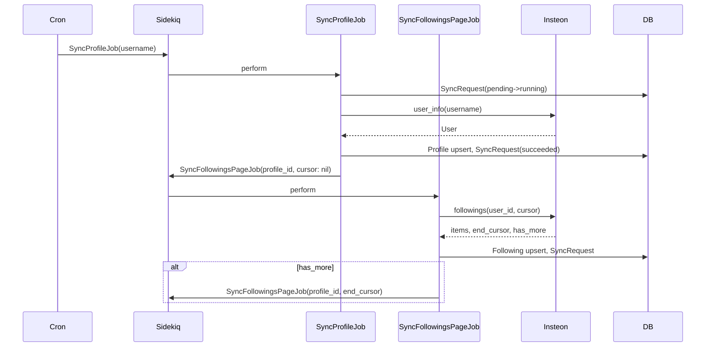

# Роадмап реализации SM Core

**Навигация:** [README](../README.md) | [Меню](00-INDEX.md) | [← Назад](07-RESILIENCE-RESTART.md)

---

Документ для загрузки как промпт-постановка задачи. Самодостаточный, последовательный, без повторов. Проект инициализируется в отдельной директории.

**Референсы (в порядке приоритета):**
- [looky_service_account_api](/Users/dostapn/dev/looky/looky_service_account_api/) — структура, Operations, спеки, secrets_manager, Docker
- [looky_reaper_service](/Users/dostapn/dev/looky/looky_reaper_service/) — Sidekiq, sync-джобы, CI/CD
- [looky-gem-insteon](file:///Users/dostapn/.rvm/gems/ruby-4.0.1@looky_reaper_service/gems/looky-gem-insteon-4.2.3/) — API синка

**Стек:** Ruby 4, Rails 8 API mode, PostgreSQL, Redis, Sidekiq, looky-gem-insteon. DRY, SOLID. **Оркестратор:** MVP — Sidekiq + cron; далее — апгрейд до Temporal standalone (не старт с нуля).

**Структура:** см. [docs/ai-prompt.md](docs/ai-prompt.md) — инструкция для ИИ-агента.

---

## 0. Подготовка (до кода)

**Название:** SM Core (sm-core) — Social Monitoring Core. Зафиксировать в README и конфигах.

---

## 1. Инициализация приложения

**Где:** новая директория (напр. sm-core).

```bash
rails new <PROJECT_NAME> --api -d postgresql -T
cd <PROJECT_NAME>
```

- `--api` — без views/helpers/assets
- `-d postgresql` — PostgreSQL
- `-T` — без Minitest (RSpec)

**Версии:** Ruby 4.x, Rails 8. Проверить `.ruby-version`, `Gemfile`.

---

## 2. Базовые зависимости и RSpec

**Gemfile:** добавить (референс: looky_service_account_api/Gemfile)

**Тесты:**
- `rspec-rails`, `factory_bot_rails`, `faker`
- `test-prof` — let_it_be для оптимизации спек
- `database_cleaner-active_record`, `webmock`, `fakeredis`
- `simplecov` — покрытие

**Качество:**
- `brakeman`, `bundler-audit`
- `rubocop-oneclick` (source: `https://rubygems.pkg.github.com/oneclick-llc`) — стиль oneclick

**Остальное:**
- `dotenv-rails` — .env в dev/test
- `pg`, `redis`, `sidekiq`, `sidekiq-scheduler` — БД, очереди
- `rails-healthcheck` — healthcheck
- `newrelic_rpm` — метрики (OpenTelemetry — позже)
- `pg_search` — полнотекстовый поиск (позже)
- `looky-gem-insteon` из GitHub Packages (source + token)
- `annotaterb` — аннотации типов
- `bullet` — N+1 в dev/test

**Команды:**
```bash
bundle install
rails g rspec:install
```

**Спеки — структура:**
- `spec/operations/`, `spec/models/`, `spec/jobs/`, `spec/services/` (зеркало app, напр. `spec/services/instagram/profile/followings_service_spec.rb`)
- Shared contexts, factories

**rails_helper.rb / spec_helper.rb:**
- Загрузка env, WebMock, DatabaseCleaner
- Fakeredis для Sidekiq/Redis
- SimpleCov, Annotaterb, Bullet (в dev/test)
- FactoryBot

---

## 3. Secrets Manager

**Файл:** `config/secrets_manager.rb`

**Логика (референс: looky_service_account_api/config/secrets_manager.rb):**
- `Rails.env.local?` (development/test в Rails 7.1+) → `require 'dotenv/load'`, хэш с `ENV.fetch('KEY', default)`
- Иначе → `ENV.fetch('KEY')` без defaults
- Итог: `SECRETS_MANAGER = keys`

**Ключи для MVP:**
- `DB_HOST`, `DB_PORT`, `DB_USERNAME`, `DB_PASSWORD` (DB_NAME опционально; по умолчанию: `sm_core_development`, `sm_core_test`, `sm_core_production`)
- `REDIS_SIDEKIQ_HOST`, `REDIS_SIDEKIQ_PORT`, `REDIS_SIDEKIQ_PASSWORD`
- `ROCKET_API_KEY`, `ROCKET_API_HOST`, `RAPID_API_KEY`, `RAPID_SCRAPER_API_HOST`
- `NEW_RELIC_LICENSE_KEY` — для NewRelic APM

**Подключение:** `require_relative 'secrets_manager'` в `config/application.rb` до инициализации приложения.

---

## 4. База данных

**database.yml:** переменные из `SECRETS_MANAGER`:
```yaml
host: <%= SECRETS_MANAGER['DB_HOST'] %>
port: <%= SECRETS_MANAGER['DB_PORT'] %>
username: <%= SECRETS_MANAGER['DB_USERNAME'] %>
password: <%= SECRETS_MANAGER['DB_PASSWORD'] %>
database: <%= SECRETS_MANAGER['DB_NAME'] || "sm_core_#{Rails.env}" %>  # sm_core_development, sm_core_test, sm_core_production
```

**Команды:**
```bash
rails db:create
```

---

## 5. Модели и миграции

### 5.1 Profile (блогер)
```ruby
# profiles
#   id (bigint), instagram_id (string, unique, not null), username, full_name, bio, avatar_url,
#   follower_count, following_count, post_count (integer, default 0),
#   is_private, is_verified (boolean, default false),
#   last_synced_at (datetime), created_at, updated_at
```
Индекс: `unique index on instagram_id`.

### 5.2 Following (подписка блогера)
```ruby
# followings
#   id, profile_id (FK -> profiles), target_instagram_id, target_username, target_full_name,
#   created_at, updated_at
#   unique [profile_id, target_instagram_id]
```

### 5.3 SyncRequest (состояние одного запроса к API)
Один запрос к Insteon = одна запись. Атомарность.

| Поле | Тип | Описание |
|------|-----|----------|
| id | bigint | PK |
| kind | string | `profile`, `followings_page` |
| profile_id | bigint | FK, nullable для kind=profile |
| status | string | `pending`, `running`, `succeeded`, `failed`, `partial` |
| cursor | jsonb | `{ end_cursor, api_provider }` |
| result_summary | jsonb | `{ items_count, has_more }` |
| error_message | text | при failed |
| started_at, finished_at | datetime | |
| created_at, updated_at | datetime | |

Индексы: `(profile_id, kind, status)`, `(status)`.

**Raw JSON не хранить.** Достаточно result_summary + данные в profiles/followings.

---

## 6. Docker

**Референс:** looky_service_account_api/Dockerfile, looky_reaper_service/Dockerfile.

**Упрощения для sm-core:**
- Ruby 4-slim
- Без Kafka, ffmpeg, librdkafka
- Оставить: libpq5, postgresql-client, tzdata, curl, libjemalloc2
- Multi-stage: builder (bundle install) → base (runtime)

**entrypoints/docker-entrypoint.sh:**
- `START_MODE=api` → `bin/rails db:migrate` + `bundle exec falcon host` (или puma)
- `START_MODE=sidekiq` → `bundle exec sidekiq`
- `START_MODE=temporal` → (при апгрейде) `bundle exec temporal worker`
- Иначе → exit 2

**docker-compose:** app, postgres, redis. Env из .env.

---

## 6.1 Метрики (NewRelic)

**Первый этап:** только NewRelic. OpenTelemetry — позже.

- Gem: `newrelic_rpm`
- `config/newrelic.yml` — license_key из `SECRETS_MANAGER['NEW_RELIC_LICENSE_KEY']`
- Метрики: throughput, latency, errors, custom metrics (опционально: `NewRelic::Agent.record_custom_event`)
- Sidekiq: `sidekiq` gem интегрируется с NewRelic; джобы видны в APM

---

## 7. CI/CD

**Референс:** looky_service_account_api/.github/workflows/github_actions_config.yml, looky_reaper_service/.github/workflows/.

**ci-tests.yml:**
- Ruby 4, postgres service, redis service
- `bundle install`, `rails db:schema:load`, `rspec`
- RuboCop (rubocop-oneclick), bundler-audit, brakeman (continue-on-error для security)
- Env vars для тестов: DB_*, REDIS_*, ROCKET_API_KEY, RAPID_API_KEY, NEW_RELIC_LICENSE_KEY (заглушки; NewRelic в test отключить через env)

**cd-build.yml:** build + push в Yandex CR. `# CHANGED: yc_cr_repository -> sm-core`

**cd-deploy-stage.yml** / **cd-deploy-prod.yml** — аналогично, с пометками замены registry/repository.

---

## 8. Insteon

**API (looky-gem-insteon, lib/insteon.rb):**
- `Insteon.user_info(username: '...')` или `Insteon.user_info(user_id: '...')` — возвращает `{ success?, item: Insteon::User, error, api_provider }`
- `Insteon.followings(user_id: '...', count: 50, end_cursor: nil, last_provider_name: nil)` — возвращает `{ success?, items: [Insteon::Following], end_cursor, has_more?, api_provider, error }`. Для пагинации обязательно передавать `last_provider_name` вместе с `end_cursor`.

**config/initializers/insteon.rb:**
```ruby
Insteon.configure do |config|
  config.apis = {
    'rocket' => { host: ..., api_key: SECRETS_MANAGER['ROCKET_API_KEY'], rate_limit: {...}, available_methods: %w[user_info followings ...] },
    'scraper' => { host: ..., api_key: SECRETS_MANAGER['RAPID_API_KEY'], ... }
  }
  config.priority = ['rocket', 'scraper']
end
```

**Спеки:** мок Insteon в rails_helper (как в looky_service_account_api) или VCR для интеграционных тестов.

---

## 9. Синк: сервисы и джобы

**Принцип:** одна джоба = один запрос к Insteon. Состояние в SyncRequest. Методы в сервисах: `sync` (общий) и `sync_page` (частный, атомарный) — разнести на два метода удобнее всего.

**Структура сервисов:** все сущности привязаны к профилю. `ProfileService` — верхний уровень; `Profile::FollowingsService`, позже `Profile::PostsService`, `Profile::ReelsService`, `Profile::HighlightsService` — вложены под профиль.[^1]

### 9.1 Instagram::ProfileService (`app/services/instagram/profile_service.rb`)
- Метод `sync(username:)` или `sync(user_id:)` — один запрос user_info, upsert Profile, SyncRequest
- Вход: `username` или `user_id`
- Вызов: `Insteon.user_info(...)`
- Выход: Profile или ошибка

### 9.2 Instagram::Profile::FollowingsService (`app/services/instagram/profile/followings_service.rb`)
- Метод `sync_page(profile_id:, end_cursor:, api_provider:)` — одна страница, атомарно
- Метод `sync(profile_id:)` — общий: триггер полного синка (ставит первую джобу или вызывает sync_page в цикле — по решению)
- `sync_page`: вызов `Insteon.followings(...)`, upsert Followings, SyncRequest, возврат has_more, end_cursor, api_provider

### 9.3 Instagram::SyncProfileJob (`app/jobs/instagram/sync_profile_job.rb`)
- Аргументы: `username` или `profile_id`
- Создать SyncRequest (pending → running)
- Вызвать `Instagram::ProfileService.new.sync(...)`
- При успехе: поставить `Instagram::SyncFollowingsPageJob.perform_async(profile.id, nil, nil)`

### 9.4 Instagram::SyncFollowingsPageJob (`app/jobs/instagram/sync_followings_page_job.rb`)
- Аргументы: `profile_id`, `end_cursor`, `api_provider`
- Вызвать `Instagram::Profile::FollowingsService.new.sync_page(...)`
- При `has_more` — поставить себя с новым end_cursor

### 9.5 Последовательность
1. Cron → `Instagram::SyncProfileJob.perform_async('username')`
2. SyncProfileJob → ProfileService.sync → Profile → SyncFollowingsPageJob (cursor: nil)
3. SyncFollowingsPageJob → FollowingsService.sync_page → при has_more ставит себя

[^1]: Профиль — корневая сущность; followings, posts, reels, highlights — дочерние. Вложенность `profile/` отражает принадлежность к профилю и упрощает расширение (posts_service, reels_service и т.д. в том же неймспейсе).

### 9.6 Диаграмма потока синка



---

## 10. Cron

**sidekiq-scheduler** или **whenever**:
- Периодически: `Instagram::SyncProfileJob.perform_async(username)` для списка блогеров
- Список: из БД (таблица `sync_schedules` или конфиг) или ENV

---

## 11. PGSearch и API

### 11.1 pg_search
- Gem: `pg_search`
- `Profile.pg_search_scope :search_by_username_and_name, against: [:username, :full_name]`

### 11.2 API
- `GET /api/v1/bloggers?q=...&page=1&per_page=20`
- Controller → Operation в `app/operations/` (референс: looky_service_account_api)
- Operation: `Profile.search_by_username_and_name(params[:q]).page(...).per(...)`
- Serializer (Panko или Jbuilder)

---

## 12. Документация и правила

**Создать с первого дня:**
- `README.md` — описание, setup, env vars, команды запуска
- `docs/08-IMPLEMENTATION-ROADMAP.md` — этот документ (обновлять по ходу)
- `docs/ai-prompt.md` — инструкция для ИИ-агента: структура проекта, нейминг, конвенции (загружать как промпт)
- `.cursor/rules/` или `RULE.md` — правила: DRY, SOLID, запреты (git push, commit без явной команды)
- `docs/09-API.md` — описание эндпоинтов (пополняемое)

---

## 13. Первый деплой

- Healthcheck: `GET /health` или `rails-healthcheck`
- Деплой образа на stage (Yandex Cloud / k8s)
- Проверка: контейнер поднимается, healthcheck OK, Sidekiq обрабатывает джобы

---

## Чеклист MVP

- [ ] Rails API + PostgreSQL + Redis + Sidekiq
- [ ] Secrets Manager + .env.example
- [ ] Модели: Profile, Following, SyncRequest
- [ ] Insteon config + Instagram::ProfileService, Instagram::Profile::FollowingsService + Jobs
- [ ] Cron для списка блогеров
- [ ] Docker + docker-compose
- [ ] CI (tests, lint) + CD (build)
- [ ] Спеки на сервисы и джобы
- [ ] PGSearch + API bloggers
- [ ] README, docs/ai-prompt.md, .cursor/rules
- [ ] NewRelic APM

---

## Файлы для создания (сводка)

| Путь | Описание |
|------|-----------|
| `config/secrets_manager.rb` | Централизованные секреты |
| `config/initializers/insteon.rb` | Конфиг Insteon |
| `app/models/profile.rb` | Модель блогера |
| `app/models/following.rb` | Модель подписки |
| `app/models/sync_request.rb` | Состояние запроса |
| `app/services/instagram/profile_service.rb` | Сервис синка профиля |
| `app/services/instagram/profile/followings_service.rb` | Сервис followings (sync, sync_page) |
| `app/jobs/instagram/sync_profile_job.rb` | Джоба синка профиля |
| `app/jobs/instagram/sync_followings_page_job.rb` | Джоба страницы followings |
| `app/controllers/api/v1/bloggers_controller.rb` | API поиска блогеров |
| `Dockerfile` | Образ приложения |
| `entrypoints/docker-entrypoint.sh` | Точка входа |
| `.github/workflows/ci-tests.yml` | CI |
| `.github/workflows/cd-build.yml` | CD build |
| `docs/ai-prompt.md` | Инструкция для ИИ-агента |
| `.cursor/rules/*.md` или `RULE.md` | Правила: DRY, SOLID, запреты |

---

## 14. Апгрейд до Temporal

**Стратегия:** MVP на Sidekiq + cron → апгрейд до Temporal standalone (self-hosted). Не старт с нуля с оркестратором.

### Что потребуется при апгрейде

1. **Инфраструктура:** Temporal Server + PostgreSQL (или Cassandra) для history. Отдельный контейнер/пода.
2. **Ruby SDK:** `temporal-ruby` gem. Новый процесс: `START_MODE=temporal_worker`.
3. **Рефакторинг джоб в Activities:** Job → Activity (вызывает тот же сервис).
4. **Workflow:** цепочка perform_async → Workflow с циклом Activity.
5. **Триггер:** Cron/Sidekiq → `Temporal::Client.start_workflow(...)`.
6. **SyncRequest:** без изменений — источник истины.

### Сравнение: апгрейд vs Temporal с нуля

| Критерий | Sidekiq → апгрейд | Temporal с нуля |
|----------|-------------------|-----------------|
| **+** Время до первого синка | Дни | Недели |
| **+** Инфраструктура на старте | Только Redis | Temporal Server + БД |
| **+** Сложность входа | Низкая | Высокая |
| **+** Сервисы при переходе | Не меняются | — |
| **−** Рефакторинг оркестрации | Умеренный (Job → Activity) | Нет |
| **−** Два режима (Sidekiq, Temporal) | Временно при миграции | — |

**Вывод:** апгрейд даёт быстрый старт и проверку флоу; рефакторинг оркестрации — ограниченный (сервисы те же). Temporal с нуля — дольше до первого синка, но без последующего рефакторинга.

---

## Отличия от Reaper

- Reaper: монолитный `perform_all` (profile + posts + reels + followings в одной джобе)
- SM Core: одна джоба = один запрос; цепочка через `perform_async`
- Reaper: Kafka, S3, несколько БД
- SM Core: один PostgreSQL, Redis, без Kafka на MVP
