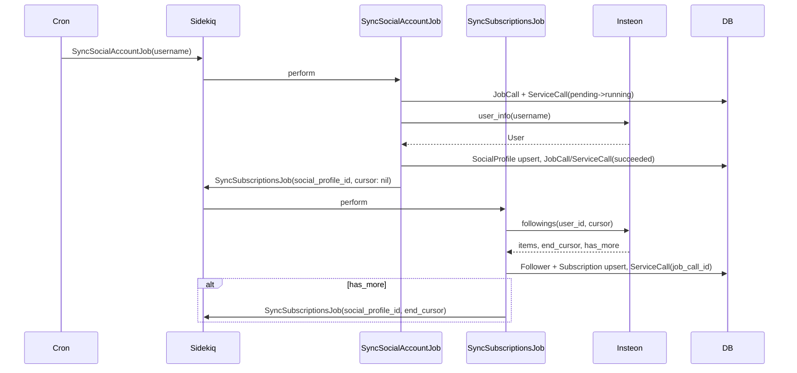

# Роадмап реализации SM Core

**Навигация:** [README](../README.md) | [Меню](00-INDEX.md) | [← Назад](07-RESILIENCE-RESTART.md)

---

Документ для загрузки как промпт-постановка задачи. Самодостаточный, последовательный, без повторов. Проект инициализируется в отдельной директории.

**Референсы (в порядке приоритета):**
- [looky_service_account_api](/Users/dostapn/dev/looky/looky_service_account_api/) — структура, Operations, спеки, secrets_manager, Docker
- [looky_reaper_service](/Users/dostapn/dev/looky/looky_reaper_service/) — Sidekiq, sync-джобы, CI/CD
- [looky-gem-insteon](file:///Users/dostapn/.rvm/gems/ruby-4.0.1@looky_reaper_service/gems/looky-gem-insteon-4.2.3/) — API синка

**Стек:** Ruby 4, Rails 8 API mode, PostgreSQL, Redis, Sidekiq, looky-gem-insteon. DRY, SOLID. **Оркестратор:** MVP — Sidekiq + cron; далее — апгрейд до Temporal standalone (не старт с нуля).

**Структура:** см. [docs/ai-prompt.md](docs/ai-prompt.md) — инструкция для ИИ-агента.

---

## 0. Подготовка (до кода)

**Название:** SM Core (sm-core) — Social Monitoring Core. Зафиксировать в README и конфигах.

---

## 1. Инициализация приложения

**Где:** новая директория (напр. sm-core).

```bash
rails new <PROJECT_NAME> --api -d postgresql -T
cd <PROJECT_NAME>
```

- `--api` — без views/helpers/assets
- `-d postgresql` — PostgreSQL
- `-T` — без Minitest (RSpec)

**Версии:** Ruby 4.x, Rails 8. Проверить `.ruby-version`, `Gemfile`.

---

## 2. Базовые зависимости и RSpec

**Gemfile:** добавить (референс: looky_service_account_api/Gemfile)

**Тесты:**
- `rspec-rails`, `factory_bot_rails`, `faker`
- `test-prof` — let_it_be для оптимизации спек
- `webmock`, `fakeredis`
- `simplecov` — покрытие

**Качество:**
- `brakeman`, `bundler-audit`
- `rubocop-oneclick` (source: `https://rubygems.pkg.github.com/oneclick-llc`) — стиль oneclick

**Остальное:**
- `dotenv-rails` — .env в dev/test
- `pg`, `redis`, `sidekiq`, `sidekiq-scheduler` — БД, очереди
- `rails-healthcheck` — healthcheck
- `newrelic_rpm` — метрики (OpenTelemetry — позже)
- `pg_search` — полнотекстовый поиск (позже)
- `looky-gem-insteon` из GitHub Packages (source + token)
- `annotaterb` — аннотации типов
- `bullet` — N+1 в dev/test

**Команды:**
```bash
bundle install
rails g rspec:install
```

**Спеки — структура:**
- `spec/operations/`, `spec/models/`, `spec/jobs/`, `spec/services/` (зеркало app, напр. `spec/services/instagram/social_profile/subscriptions_service_spec.rb`)
- Shared contexts, factories

**rails_helper.rb / spec_helper.rb:**
- Загрузка env, WebMock
- Fakeredis для Sidekiq/Redis
- SimpleCov, Annotaterb, Bullet (в dev/test)
- FactoryBot

---

## 3. Secrets Manager

**Файл:** `config/secrets_manager.rb`

**Логика (референс: looky_service_account_api/config/secrets_manager.rb):**
- `Rails.env.local?` (development/test в Rails 7.1+) → `require 'dotenv/load'`, хэш с `ENV.fetch('KEY', default)`
- Иначе → `ENV.fetch('KEY')` без defaults
- Итог: `SECRETS_MANAGER = keys`

**Ключи для MVP:**
- `DB_HOST`, `DB_PORT`, `DB_USERNAME`, `DB_PASSWORD` (DB_NAME опционально; по умолчанию: `sm_core_development`, `sm_core_test`, `sm_core_production`)
- `REDIS_SIDEKIQ_HOST`, `REDIS_SIDEKIQ_PORT`, `REDIS_SIDEKIQ_PASSWORD`
- `ROCKET_API_KEY`, `ROCKET_API_HOST`, `RAPID_API_KEY`, `RAPID_SCRAPER_API_HOST`
- `NEW_RELIC_LICENSE_KEY` — для NewRelic APM

**Подключение:** `require_relative 'secrets_manager'` в `config/application.rb` до инициализации приложения.

---

## 4. База данных

**database.yml:** переменные из `SECRETS_MANAGER`:
```yaml
host: <%= SECRETS_MANAGER['DB_HOST'] %>
port: <%= SECRETS_MANAGER['DB_PORT'] %>
username: <%= SECRETS_MANAGER['DB_USERNAME'] %>
password: <%= SECRETS_MANAGER['DB_PASSWORD'] %>
database: <%= SECRETS_MANAGER['DB_NAME'] || "sm_core_#{Rails.env}" %>  # sm_core_development, sm_core_test, sm_core_production
```

**Команды:**
```bash
rails db:create
```

---

## 5. Модели и миграции

Схема с заделом на мультиплатформу: `platform` + `ext_id` во всех сущностях.

### 5.1 SocialProfile (блогер / аккаунт в соцсети)
```ruby
# social_profiles
#   id, platform (string, not null), ext_id (string, not null), username, full_name, bio, avatar, url
#   followers_count, follows_count, posts_count (integer, default 0), engagement_rate (float)
#   last_synced_at, raw_data (jsonb), created_at, updated_at
#   unique [platform, ext_id]
```
`raw_data` — сырой payload из API (отладка, миграции). Метрики можно вынести в jsonb (StoreModel) при росте.

### 5.2 Follower (подписчик / пользователь в соцсети)
```ruby
# followers
#   id, platform (string, not null), ext_id (string), username, full_name, avatar, raw_data (jsonb)
#   created_at, updated_at
#   unique [platform, ext_id]
```

### 5.3 Subscription (подписка: SocialProfile ← Follower)
```ruby
# subscriptions
#   id, social_profile_id (FK), follower_id (FK), active (boolean, default true)
#   followed_at, unfollowed_at, created_at, updated_at
#   unique [social_profile_id, follower_id]
```
Temporal-контекст: активность, время follow/unfollow.

### 5.4 JobCall (вызов джобы, ETL-run)
**Один запуск джобы = одна запись.** ETL: extract, load, transform — не только sync. Каждая джоба на каждый запуск создаёт JobCall. Указатель на процесс, повторные запуски без конфликтов.

| Поле | Тип | Описание |
|------|-----|----------|
| id | bigint | PK |
| subject_id | bigint | FK, nullable (MVP: social_profile_id; далее — batch, и т.д.) |
| kind | string | `profile`, `followings`, `posts`, … |
| status | string | `pending`, `running`, `succeeded`, `failed`, `partial` |
| started_at, finished_at | datetime | |
| created_at, updated_at | datetime | |

### 5.5 ServiceCall (вызов сервиса внутри джобы)
**Один вызов сервиса (API, DB, и т.д.) = одна запись.** Дети JobCall. Подзадача (след. страница, следующий шаг) → ServiceCall с parent_service_call_id.

| Поле | Тип | Описание |
|------|-----|----------|
| id | bigint | PK |
| job_call_id | bigint | FK |
| parent_service_call_id | bigint | FK, nullable — предыдущий этап |
| kind | string | `profile`, `followings_page`, … |
| status | string | `pending`, `running`, `succeeded`, `failed`, `partial` |
| cursor | jsonb | курсоры, токены пагинации |
| result_summary | jsonb | метаданные результата |
| error_message | text | при failed |
| started_at, finished_at | datetime | |
| created_at, updated_at | datetime | |

**Логика:** джоба стартует → JobCall. Вызов сервиса → ServiceCall (job_call_id). Подзадача → ServiceCall с parent_service_call_id. Везде status.

---

## 6. Docker

**Референс:** looky_service_account_api/Dockerfile, looky_reaper_service/Dockerfile.

**Упрощения для sm-core:**
- Ruby 4-slim
- Без Kafka, ffmpeg, librdkafka
- Оставить: libpq5, postgresql-client, tzdata, curl, libjemalloc2
- Multi-stage: builder (bundle install) → base (runtime)

**entrypoints/docker-entrypoint.sh:**
- `START_MODE=api` → `bin/rails db:migrate` + `bundle exec puma` (Puma — дефолт Rails, стабильнее; Falcon — для I/O-bound при росте)
- `START_MODE=sidekiq` → `bundle exec sidekiq`
- `START_MODE=temporal` → (при апгрейде) `bundle exec temporal worker`
- Иначе → exit 2

**docker-compose:** app, postgres, redis. Env из .env.

---

## 6.1 Метрики (NewRelic)

**Первый этап:** только NewRelic. OpenTelemetry — позже.

- Gem: `newrelic_rpm`
- `config/newrelic.yml` — license_key из `SECRETS_MANAGER['NEW_RELIC_LICENSE_KEY']`
- Метрики: throughput, latency, errors, custom metrics (опционально: `NewRelic::Agent.record_custom_event`)
- Sidekiq: `sidekiq` gem интегрируется с NewRelic; джобы видны в APM

---

## 7. CI/CD

**Референс:** looky_service_account_api/.github/workflows/github_actions_config.yml, looky_reaper_service/.github/workflows/.

**ci-tests.yml:**
- Ruby 4, postgres service, redis service
- `bundle install`, `rails db:schema:load`, `rspec`
- RuboCop (rubocop-oneclick), bundler-audit, brakeman (continue-on-error для security)
- Env vars для тестов: DB_*, REDIS_*, ROCKET_API_KEY, RAPID_API_KEY, NEW_RELIC_LICENSE_KEY (заглушки; NewRelic в test отключить через env)

**cd-build.yml:** build + push в Yandex CR. `# CHANGED: yc_cr_repository -> sm-core`

**cd-deploy-stage.yml** / **cd-deploy-prod.yml** — аналогично, с пометками замены registry/repository.

---

## 8. Insteon

**API (looky-gem-insteon, lib/insteon.rb):**
- `Insteon.user_info(username: '...')` или `Insteon.user_info(user_id: '...')` — возвращает `{ success?, item: Insteon::User, error, api_provider }`
- `Insteon.followings(user_id: '...', count: 50, end_cursor: nil, last_provider_name: nil)` — возвращает `{ success?, items: [Insteon::Following], end_cursor, has_more?, api_provider, error }`. Для пагинации обязательно передавать `last_provider_name` вместе с `end_cursor`.

**config/initializers/insteon.rb:**
```ruby
Insteon.configure do |config|
  config.apis = {
    'rocket' => { host: ..., api_key: SECRETS_MANAGER['ROCKET_API_KEY'], rate_limit: {...}, available_methods: %w[user_info followings ...] },
    'scraper' => { host: ..., api_key: SECRETS_MANAGER['RAPID_API_KEY'], ... }
  }
  config.priority = ['rocket', 'scraper']
end
```

**Спеки:** мок Insteon в rails_helper (как в looky_service_account_api) или VCR для интеграционных тестов.

---

## 9. Синк: сервисы и джобы

**Принцип:** одна джоба = один запрос к Insteon. **ETL-модель:** JobCall — обёртка над джобой; ServiceCall — вызов сервиса внутри. Джоба → JobCall. Вызов сервиса → ServiceCall (job_call_id). Подзадача → ServiceCall с parent_service_call_id. Методы: `sync` (общий), `sync_page` (атомарный).

**Структура сервисов:** все сущности привязаны к SocialProfile. `SocialProfileService` — верхний уровень; `SocialProfile::SubscriptionsService`, позже `SocialProfile::PostsService`, `SocialProfile::ReelsService`, `SocialProfile::HighlightsService` — вложены под профиль.[^1]

### 9.1 Instagram::SocialProfileService (`app/services/instagram/social_profile_service.rb`)
- Метод `sync(username:)` или `sync(user_id:)` — один запрос user_info, upsert SocialProfile, JobCall + ServiceCall
- Вход: `username` или `user_id`
- Вызов: `Insteon.user_info(...)`
- Выход: SocialProfile или ошибка

### 9.2 Instagram::SocialProfile::SubscriptionsService (`app/services/instagram/social_profile/subscriptions_service.rb`)
- Метод `sync_page(social_profile_id:, end_cursor:, api_provider:)` — одна страница, атомарно
- Метод `sync(social_profile_id:)` — общий: триггер полного синка (ставит первую джобу или цикл sync_page)
- `sync_page`: вызов `Insteon.followings(...)`, upsert Follower + Subscription, ServiceCall (при пагинации — child с parent_service_call_id), возврат has_more, end_cursor, api_provider

### 9.3 Instagram::SyncSocialAccountJob (`app/jobs/instagram/sync_social_account_job.rb`)
- Аргументы: `username` или `social_profile_id`
- Создать JobCall + ServiceCall (pending → running)
- Вызвать `Instagram::SocialProfileService.new.sync(...)`
- При успехе: поставить `Instagram::SyncSubscriptionsJob.perform_async(social_profile.id, nil, nil)`

### 9.4 Instagram::SyncSubscriptionsJob (`app/jobs/instagram/sync_subscriptions_job.rb`)
- Аргументы: `social_profile_id`, `end_cursor`, `api_provider`
- Вызвать `Instagram::SocialProfile::SubscriptionsService.new.sync_page(...)`
- При `has_more` — поставить себя с новым end_cursor

### 9.5 Последовательность
1. Cron → `Instagram::SyncSocialAccountJob.perform_async('username')`
2. SyncSocialAccountJob → SocialProfileService.sync → SocialProfile → SyncSubscriptionsJob (cursor: nil)
3. SyncSubscriptionsJob → SubscriptionsService.sync_page → Follower + Subscription; при has_more ставит себя

[^1]: SocialProfile — корневая сущность; subscriptions (followers), posts, reels, highlights — дочерние. Вложенность `social_profile/` отражает принадлежность.

### 9.6 Диаграмма потока синка



---

## 10. Cron

### sidekiq-scheduler
- Периодически: `Instagram::SyncSocialAccountJob.perform_async(username)` для списка блогеров
- Список: из БД (таблица `sync_schedules` или конфиг) или ENV - в процессе реализации

---

## 11. PGSearch и API

### 11.1 pg_search
- Gem: `pg_search`
- `SocialProfile.pg_search_scope :search_by_username_and_name, against: [:username, :full_name]`
- Scope по platform: `instagram` для MVP

### 11.2 API
- `GET /api/v1/bloggers?q=...&page=1&per_page=20&platform=instagram`
- Controller → Operation в `app/operations/` (референс: looky_service_account_api)
- Operation: `SocialProfile.where(platform: 'instagram').search_by_username_and_name(params[:q]).page(...).per(...)`
- Serializer (Panko или Jbuilder)

---

## 12. Документация и правила

**Создать с первого дня:**
- `README.md` — описание, setup, env vars, команды запуска
- `docs/08-IMPLEMENTATION-ROADMAP.md` — этот документ (обновлять по ходу)
- `docs/ai-prompt.md` — инструкция для ИИ-агента: структура проекта, нейминг, конвенции (загружать как промпт)
- `.cursor/rules/` или `RULE.md` — правила: DRY, SOLID, запреты (git push, commit без явной команды)
- `docs/09-API.md` — описание эндпоинтов (пополняемое)

---

## 13. Первый деплой

- Healthcheck: `GET /health` или `rails-healthcheck`
- Деплой образа на stage (Yandex Cloud / k8s)
- Проверка: контейнер поднимается, healthcheck OK, Sidekiq обрабатывает джобы

---

## Дорожная карта: последовательность действий

Пошаговый план от нуля до работающего синка. Выполнять по порядку.

- [x] 1. **Подготовка** — Согласовать название SM Core (sm-core) → README, конфиги
- [x] 2. **Инициализация** — `rails new sm-core --api -d postgresql -T` → Базовая структура app/, config/, db/
- [x] 3. **Gemfile** — Добавить rspec, sidekiq, pg, redis, dotenv, rubocop-oneclick, looky-gem-insteon и др. → `bundle install`
- [x] 4. **RSpec** — `rails g rspec:install`, настроить rails_helper (WebMock, fakeredis, use_transactional_fixtures) → `bundle exec rspec` проходит
- [x] 5. **Документация** — README, docs/ai-prompt.md, .cursor/rules, .env.example → Правила и setup описаны
- [x] 6. **Secrets Manager** — Создать config/secrets_manager.rb (DB_*, REDIS_*, ROCKET_API_KEY, RAPID_API_KEY) → `SECRETS_MANAGER` доступен
- [ ] 7. **database.yml** — Подключить SECRETS_MANAGER, БД sm_core_development/test/production → `rails db:create`
- [ ] 8. **Миграция SocialProfile** — platform, ext_id, username, full_name, bio, avatar, url, followers_count, follows_count, posts_count, engagement_rate, last_synced_at, raw_data → `rails db:migrate`
- [ ] 9. **Миграция Follower** — platform, ext_id, username, full_name, avatar, raw_data → Индекс (platform, ext_id) UNIQUE
- [ ] 10. **Миграция Subscription** — social_profile_id, follower_id, active, followed_at, unfollowed_at → Индекс (social_profile_id, follower_id) UNIQUE
- [ ] 11. **Миграция JobCall** — subject_id, kind, status, started_at, finished_at → Вызов джобы (ETL-run)
- [ ] 12. **Миграция ServiceCall** — job_call_id, parent_service_call_id, kind, status, cursor, result_summary, error_message → Вызов сервиса, цепочка parent
- [ ] 13. **Модели** — SocialProfile, Follower, Subscription, JobCall, ServiceCall + ассоциации → `has_many` / `belongs_to`
- [ ] 14. **Спеки моделей** — spec/models/social_profile_spec.rb и др. → Валидации, ассоциации покрыты
- [ ] 15. **Insteon** — config/initializers/insteon.rb, ROCKET_API_KEY, RAPID_API_KEY → `Insteon.user_info`, `Insteon.followings` работают
- [ ] 16. **Спеки Insteon** — Мок или VCR в rails_helper → Интеграционные тесты
- [ ] 17. **SocialProfileService** — Instagram::SocialProfileService#sync — user_info → SocialProfile upsert → Сервис + спек
- [ ] 18. **SubscriptionsService** — Instagram::SocialProfile::SubscriptionsService#sync_page — followings → Follower + Subscription upsert → Сервис + спек
- [ ] 19. **SyncSocialAccountJob** — Создать JobCall + ServiceCall, вызвать SocialProfileService, поставить SyncSubscriptionsJob → Джоба + спек
- [ ] 20. **SyncSubscriptionsJob** — Вызвать SubscriptionsService#sync_page, при has_more — perform_async → Джоба + спек
- [ ] 21. **Cron** — sidekiq-scheduler: периодически SyncSocialAccountJob для списка username → Синк запускается по расписанию
- [ ] 22. **Docker** — Dockerfile, entrypoints/docker-entrypoint.sh (api, sidekiq) → `docker-compose up`
- [ ] 23. **CI/CD** — ci-tests.yml, cd-build.yml → Push → тесты, build образа
- [ ] 24. **PGSearch** — SocialProfile.pg_search_scope → Поиск по username, full_name
- [ ] 25. **API bloggers** — GET /api/v1/bloggers?q=...&platform=instagram → Controller → Operation → Serializer
- [ ] 26. **Деплой** — Healthcheck, образ в Yandex CR, деплой на stage → Контейнер поднят, Sidekiq обрабатывает джобы

---

## Файлы для создания (сводка)

| Путь | Описание |
|------|-----------|
| `config/secrets_manager.rb` | Централизованные секреты |
| `config/initializers/insteon.rb` | Конфиг Insteon |
| `app/models/social_profile.rb` | Модель блогера (platform, ext_id) |
| `app/models/follower.rb` | Модель подписчика |
| `app/models/subscription.rb` | Связь SocialProfile ↔ Follower |
| `app/models/job_call.rb` | Вызов джобы (ETL-run) |
| `app/models/service_call.rb` | Вызов сервиса внутри джобы (job_call_id, parent_service_call_id) |
| `app/services/instagram/social_profile_service.rb` | Сервис синка SocialProfile |
| `app/services/instagram/social_profile/subscriptions_service.rb` | Сервис Subscriptions (sync, sync_page) |
| `app/jobs/instagram/sync_social_account_job.rb` | Джоба синка аккаунта (профиль + followings) |
| `app/jobs/instagram/sync_subscriptions_job.rb` | Джоба страницы subscriptions (followings) |
| `app/controllers/api/v1/bloggers_controller.rb` | API поиска блогеров |
| `Dockerfile` | Образ приложения |
| `entrypoints/docker-entrypoint.sh` | Точка входа |
| `.github/workflows/ci-tests.yml` | CI |
| `.github/workflows/cd-build.yml` | CD build |
| `docs/ai-prompt.md` | Инструкция для ИИ-агента |
| `.cursor/rules/*.md` или `RULE.md` | Правила: DRY, SOLID, запреты |

---

## 14. Апгрейд до Temporal

**Стратегия:** MVP на Sidekiq + cron → апгрейд до Temporal standalone (self-hosted). Не старт с нуля с оркестратором.

### Что потребуется при апгрейде

1. **Инфраструктура:** Temporal Server + PostgreSQL (или Cassandra) для history. Отдельный контейнер/пода.
2. **Ruby SDK:** `temporal-ruby` gem. Новый процесс: `START_MODE=temporal_worker`.
3. **Рефакторинг джоб в Activities:** Job → Activity (вызывает тот же сервис).
4. **Workflow:** цепочка perform_async → Workflow с циклом Activity.
5. **Триггер:** Cron/Sidekiq → `Temporal::Client.start_workflow(...)`.
6. **JobCall + ServiceCall:** без изменений — источник истины (ETL-run, цепочка вызовов).

### Сравнение: апгрейд vs Temporal с нуля

| Критерий | Sidekiq → апгрейд | Temporal с нуля |
|----------|-------------------|-----------------|
| **+** Время до первого синка | Дни | Недели |
| **+** Инфраструктура на старте | Только Redis | Temporal Server + БД |
| **+** Сложность входа | Низкая | Высокая |
| **+** Сервисы при переходе | Не меняются | — |
| **−** Рефакторинг оркестрации | Умеренный (Job → Activity) | Нет |
| **−** Два режима (Sidekiq, Temporal) | Временно при миграции | — |

**Вывод:** апгрейд даёт быстрый старт и проверку флоу; рефакторинг оркестрации — ограниченный (сервисы те же). Temporal с нуля — дольше до первого синка, но без последующего рефакторинга.

---

## Отличия от Reaper

- Reaper: монолитный `perform_all` (profile + posts + reels + followings в одной джобе)
- SM Core: одна джоба = один запрос; цепочка через `perform_async`
- Reaper: Kafka, S3, несколько БД
- SM Core: один PostgreSQL, Redis, без Kafka на MVP
